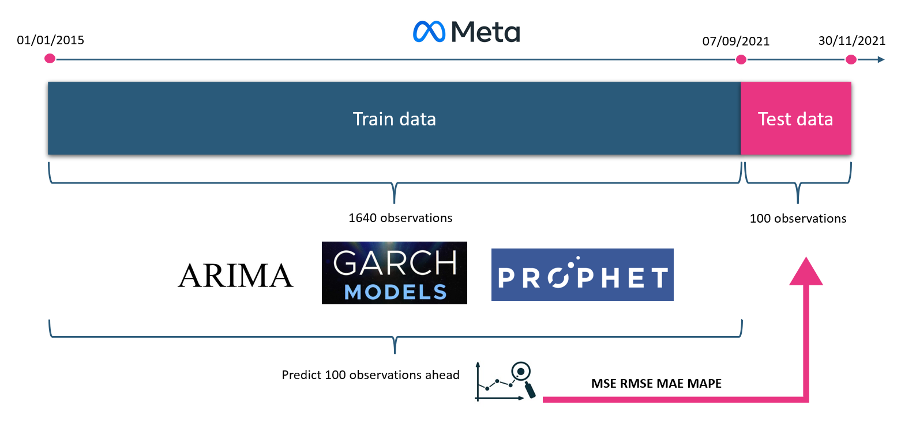

<style type="text/css">

body{ /* Normal  */
      font-size: 12px;
}
code.r{
  font-size: 11px;
}
pre {
  font-size: 11px
}
td {  /* Table  */
  font-size: 12px;
}
h1.title {
  font-size: 32px;
  font-weight: bold;
  text-align: center;
  color: #2A5A7A;
  opacity: 0.8;
}
h4.author { 
  font-size: 15px;
  color: #468faf;
  text-align: center;
}
h4.date { 
  font-size: 16px;
  font-family: "Times New Roman", Times, serif;
  color: DarkRed;
  text-align: center;
}
h1 { /* Header 1 */
  font-size: 22px;
  color: Black;
  font-weight: bold;
}
h2 { /* Header 2 */
    font-size: 18px;
  color: Black;
  font-weight: bold
}
h3 { /* Header 3 */
  font-size: 15px;
  color: Black;
  font-weight: bold
}

</style>

```{r setup, include=FALSE}
# Set the default mode for all the chunks
knitr::opts_chunk$set(message = FALSE, warning = FALSE, fig.align = "center", 
                      fig.height = 5, fig.width = 8)
```

```{r load-packages, include=FALSE}
library(quantmod)              # download stock price
library(tidyverse)
library(dplyr)
library(ggplot2)
library(lubridate)
library(tseries)               # for ts object, ADF test
library(forecast)              # to predict price 
library(prophet)
library(astsa)                 # for ARIMA model, check residual
library(PerformanceAnalytics)  # compute returns
library(rugarch)               # for GARCH
library(xts)
library(MTS)                   # ARCH test
library(ie2misc)               # to calculate MAPE
```

# Introduction

## Motivation

*“Forecasting: the attempt to predict the unknowable by measuring the irrelevant; this task employs most people on Wall Street.”* (Zweig, 2015) Many financial forecasters, companies, strategists speculate the stock market daily, monthly, or even a year ahead. Furthermore, investors constantly evaluate the historical price and use it to affect their future investment decisions (Yates, 2021). Financial instrument prognostication is challenging because the future depends on numerous factors in the market. However, in the era of machine learning, our research attempts to compare and evaluate three widely used machine learning models for time series.  

The goal of the study is to compare the accuracy from three different machine learning methods to predict Meta (Facebook) stock price and returns with volatility (depending on the models):

* **ARIMA**: Auto-regressive integrated moving average is one of the more popular and widely used statistical methods for time-series forecasting. It is a class of statistical algorithms that captures the standard temporal dependencies unique to time-series data (Nathaniel, 2021). ARIMA is used to predict price in the research. 
* **GARCH**: Generalized autoregressive conditional heteroskedasticity, a statistical modeling technique used to help predict the volatility of returns on financial assets. GARCH is appropriate for time series where the variance of the error term is serially autocorrelated following an autoregressive moving average process (Rasure, 2021). 
* **Prophet**: a procedure for forecasting time series data based on an additive model where non-linear trends are fit with yearly, weekly, and daily seasonality, plus holiday effects. It works best with time series with substantial seasonal effects and several seasons of historical data (Facebook, 2021). Prophet is conducted to predict the price. 

## Methodology

The figure below briefly explains the research methodology:



To achieve the goals, the study conducts the following steps:

1. **Getting Meta stock daily price** by ticker via API from Yahoo Finance from 01 Jan 2015 to 31 Oct 2021 (the predefined time window but the dataframe might change due to stocks are not traded on weekends).

2. **Explanatory data analysis (EDA)**: data visualization, summary statistics, autocorrelation functions, and partial autocorrelation functions, several tests such as Augmented Dickey-Fuller (ADF) to check (non-)stationary of the time series, Lagrange Multiplier test to check ARCH effects.

3. **Train and test data division**: because the stock price fluctuates and is hard to predict, the test set is with only the last 100 days, which is not to long but still fulfills the GARCH forecast. The time series are divided into train (day 1 2015 - day 80 2021) and test (day 80 2021 - day 180 2021) sets. Notably, as the stock is only traded from Monday to Friday, we consider a trading year with holidays having 260 days (according to Bieri, 2021). 


4. **Fitting models**: various packages used to apply ARIMA, GARCH, and Prophet. Under each machine learning technique, the study attempts to fit models through several ways, then evaluate the models to check their validity. Next, the best model for each category is selected in the final report. For example, we can compare several GARCH models to select the most appropriate one. Importantly, fitting models are implemented on the train set. 

5. **Forecasting**: Once the chosen model is ready, we forecast 100 days (i.e., predicted value).

6. **Measuring model accuracy**: this is an important part where we check the Root Mean Square Error (RMSE) and the Mean absolute percentage error (MAPE) of the predicted value compared to the test set's actual value:

- RMSE: the standard deviation of the residuals (prediction errors) measures how far from the regression line data points are, and the spread of these residuals (Glen, 2021).

$$ RMSE = \sqrt{\frac{1}{N} \sum_{i = 1}^{N} (Actual_{i} - Forecast_{i})^2} $$

- MAPE: A major problem arises when comparing forecasting methods and models across different time series with different units. One of the most commonly used measures that avoids this problem is MAPE (Myttenaere, Golden, Le Grand, & Rossi, 2017).  

$$ MAPE = \frac{1}{N} \sum_{i = 1}^{N} |\frac {Actual_{i} - Forecast_{i}} {Actual_{i}}| * 100$$

The model with the lowest MAPE will be the winner. 

## Documentation and scope

Because the EDA and the entire analysis are long and out of the report length limitation, the author created two R markdown files corresponding to two HTML files:

* `meta_analysis.Rmd`, `meta_analysis.html`: The complete analysis with the step-by-step procedure to choose the best model of each type (a draft version with all codes displayed)
* `TSA_FinalReport.Rmd`, `TSA_FinalReport.html`: The final report with only important findings

Moreover, not all the codes will be shown in the `TSA_FinalReport.html` due to the restriction. The study scope solely focuses on one stock as univariate time series with three machine learning methods. In other words, we examine how well each machine learning model performs on the same dataset. Also, the algorithm and mathematics behind each machine learning method is out of this research's scope. 

```{r load-data, include = FALSE}
# Downloading Meta ("FB") via Yahoo Finance API
Meta <- NULL
tickers_index <- c("FB")

for (Ticker in tickers_index) {
  Meta <- cbind(
    Meta,
    getSymbols.yahoo(
      Ticker,
      from = "2015-01-01",
      to = "2021-11-30",          
      periodicity = "daily",
      auto.assign = FALSE
    )[, 6]                        # Only adjusted close
  )
}

# Change Meta to dataframe for the prophet model later
d_meta <- broom::tidy(Meta)

# Select relevant columns & change column names
d_meta <- d_meta %>% select(index, value) %>% 
  rename(date_meta = index, price_meta = value)

# Glimpse on the data
glimpse(d_meta)
```

# Descriptive analysis

## Stock price

Let's first have a look at the time series:

```{r plot-timeseries, echo = FALSE}
# Plot the time series
plot(Meta)
```

Meta price plot displays multiplicative trend and multiplicative seasonality. The critical task at this stage is to assess the time series' stationery. Obviously, according to the graph above, it is not stationary. Yet, we conduct the Augmented Dickey-Fuller (ADF), a so-called test to check whether a time series is (non-)stationary (Ankenbrand & Bieri, 2021). The hypotheses are formed as follows:

* $H_{0}: \rho = 1$: Time series has a unit root, hence, non-stationary, shows a trend over time 
* $H_{1}: -1 < \rho < 1$: Time series is stationary

```{r ADF-test-price, include = TRUE}
# Conduct ADF test for price
adf.test(Meta)
```

p-value > $\alpha$ of 0.05: fail to reject $H_{0}$, this time series is not stationary.

```{r ADF-test-log-price, include = TRUE}
# Conduct ADF test for logged price
adf.test(log(Meta))
```

p-value > $\alpha$ of 0.05: fail to reject $H_{0}$, this log-transformed time series is not stationary. Later, when applying `log(Meta)` in ARIMA with differencing d = 1, it will become stationary. Since the time series includes the trend, seasonality and remainder components, it's important to have a glance at their decomposed elements:

```{r decompose-ts, echo = FALSE}
# Create timeseries object with frequency 260 days/year (according to Bieri(2021))
ts_meta <- ts(d_meta$price_meta, start = c(2015, 1), frequency = 260)

# Seasonal Decomposition of Time Series by Loess
stl_meta <- stl(ts_meta, s.window = "periodic")
plot(stl_meta)
```

## Continous returns

We had seen the price of Meta, it's even more essential to check the continuous returns. The continuous growth rates or returns are additive and generally favored to discrete growth rates/returns in time series analysis. In this case, we put the histogram and boxplot together in one graph to provide a comprehensive view over the continuous returns of Meta:

```{r histogram-return, echo = FALSE, fig.height=4}
# Calculating continuous returns 
returns_meta <- na.omit(diff(log(Meta)))
colnames(returns_meta)<-"returns_meta"

# Histogram
histogram_meta_return <- ggplot(returns_meta, mapping = aes(x = returns_meta)) +
  geom_histogram(color="black", fill = "grey", bins = 50) +
  #geom_density(alpha=.2, color ="blue") +
  scale_x_continuous() +
  labs(title = "Histogram and boxplot of Meta returns") +
  theme_minimal() +
  theme(plot.title = element_text(hjust = 0.5, face = "bold"))

# Boxplot
boxplot_meta_return <- ggplot(returns_meta, mapping = aes(x = "", y = returns_meta)) +
  geom_boxplot(color = "black", fill = "grey") +
  scale_y_continuous() +
  coord_flip() +
  xlab("") +
  theme_minimal()

# Display two plots together
egg::ggarrange(histogram_meta_return, boxplot_meta_return, heights = 2:1)
```

The histogram of Meta returns looks quite bell-shaped with many tails on both sides but let's check the basic statistics for skewness and kurtosis. 

```{r Skewness-Kurtosis-return}
psych::describe(returns_meta)
```

* Skew = -0.7: Moderate skewed distribution with long. Remarkably, there are two data points on the far left presenting the two negative returns.
* Kurtosis = 13: Leptokurtic distribution with long tails and concentrated toward the mean. Compared to a normal distribution, its tails are longer and fatter, and often its central peak is higher and sharper.

```{r plot-return, echo = FALSE, fig.height = 4}
# Plot the returns
plot(returns_meta)
```

As expected from Kurtosis, the plot of returns exhibits constant trend around the mean of 0. Nevertheless, the return variability changes and is not constant over time (i.e. high volatility). We test ADF once more time with the returns:

```{r ADF-test-returns, include = TRUE}
# Conduct ADF test for the returns
adf.test(returns_meta)
```

p-value < $\alpha$: reject $H_{0}$: The continuous returns are stationary. 


# ARIMA

```{r train-test-split, include = FALSE}
train <- window(ts_meta, start = c(2015, 1), end=c(2021, 80))
test <- window(ts_meta, start=c(2021, 81), end = c(2021, 180))
```

To fit an ARIMA model, we must perform preliminary checks:

- Is the model stationary?
- Do the properties of (P)ACF match?
- Which orders of p, d, q?

```{r acf-pacf-log-meta, echo = FALSE}
# ACF & PACF of logged meta
tsdisplay(log(Meta), points = FALSE)
```

ACF decays in a linear fashion and outside of the confidence band and PACF is almost at 1 and clear cuts off at lag 1. 

## Fiting model

```{r ARIMA-selecting-aic, include = FALSE}
# Identifying p, q of the ARIMA(p,1,q)-model by testing different specifications
max.order <- 6 # We only allow a maximum of 6 AR- and/or MA-terms 
d <- 1         # we difference at lag 1 then the time series became stationary

# Defining the matrix in for values of the AICs for different model specifications are stored
arima_aic <- matrix(NA, ncol=max.order+1, nrow=max.order+1)
row.names(arima_aic) <- c(0:max.order) # Order of AR(p) in rows
colnames(arima_aic) <- c(0:max.order) # Order of MA(q) in columns

# Calculating and storing the AICs for different model specifications
for(i in 0:max.order){
  for(j in 0:max.order){
    arima_aic[i+1,j+1] <- Arima(y=log(train), order=c(i,d,j), include.constant = TRUE)$aic
  }
}

# Finding the model specification which minimizes the AIC
index <- which(arima_aic == min(arima_aic), arr.ind = TRUE)
ar <- as.numeric(rownames(arima_aic)[index[1]])
ma <- as.numeric(colnames(arima_aic)[index[2]])

# Estimating the optimal ARIMA-model and testing for significance of the coefficients
fit_arima <- Arima(y=log(train), order=c(ar,1,ma), include.constant = TRUE)
```

Here, the selected model was done by choosing p and q parameter with the lowest AIC and predefined d = 1. 

```{r ARIMA-model-showing}
fit_arima
```

Similarly, another way is using `auto.arima` with specific parameter indications (stepwise = FALSE, 
approximation = FALSE, seasonal = FALSE), we got ARIMA(4,1,4) with drift. Without these parameters, the function takes some optimization shortcuts in order to be fast and hence, leading to ARIMA(0,1,1) model. The parameters were set according to Bieri (2021).   

## Residual analysis

The goal of this part is to ensure that the residuals are white Gaussian noise. After getting ARIMA(4,1,4) from the previous part, we evaluate the residuals of these two models. `Sarima()` function is a very compacted to get all of needed graphs at once, hence we use it here to analyse the residuals:

```{r residual-check-auto-arima, results='hide',fig.keep='all', echo = FALSE}
# Use sarima to show all plots at once
sarima(log(train), 4,1,4)
```

Some of the noticeable observations are as follows:

- Standardized residuals: no obvious pattern detection.
- Sample ACF of residuals: 95% of the ACF values should be between the confidence band. ARIMA(4,1,4) has most of ACF stay in the confidence range.
- Normal Q-Q plot: if the residuals are normal, the points will be in the blue line. However, there are often extreme value on the ends as in the graph. If there are no huge departures from the line, the normal assumption is reasonable.
- Q-statistic p-values: if most points are above the blue lines, we can assume white noise. If this is not the case, there might be some correlation left in the residuals, we might consider to fit another model or add a parameter. Here, the Lijung-Box for ARIMA(4,1,4) shows all the points above the line.

## Forecasting

Our chosen model is ARIMA(4,1,4) because our residual diagnostics the residual of ARIMA(4,1,4)'s noise is white and their AIC & AICc are lowest. The function `sarima.for()` generates a detailed plot of the prediction:

```{r forecast-arima, echo = FALSE, results='hide', fig.keep='last', fig.height= 4.5}
# Creating 2 windows 
## From the beginning to day 100, 2021
window1_meta <- window(ts_meta, end = c(2021, 80))
## From the beginning to day 180, 2021
window2_meta <- window(ts_meta, end = c(2021, 180))

# Forecasting 100 days using astsa package 
sarima.for(log(window1_meta), n.ahead = 100, 4, 1, 4)
lines(log(window2_meta))
```


```{r forecast-arima-plot, echo = FALSE, fig.height = 4.5, include = FALSE}
# Forecasting 100 days using forecast
pred_arima <- forecast(fit_arima, level = 0.95, h = 100)
autoplot(pred_arima, ylab="Meta")
```

# GARCH

GARCH model is used to predict volatility of the future returns. To be more specific, the GARCH approach models the variance using the prediction errors $e_{t}$ (also called shocks or unexpected returns). The parameter $\alpha$ determines the reactivity to $e_{t}^2$, while $\beta$ is the weight on the previous variance prediction.

## ARCH test

Before applying GARCH, we check whether the data present ARCH effect. This following test is a Lagrange Multiplier test and uses the following hypothesis:

- Ho: Residuals exhibits no ARCH effects.
- H1: ARCH(lag) effects are present.

```{r arch-test}
archTest(fit_arima$residuals)
```

p-value < 0.05, we reject Ho. Hence, there are ARCH effects and now we can apply GARCH model. Since there is no obvious method to decide the best GARCH model, we tried different ways. The detail of choosing GARCH model can be found in the `meta_analysis.Rmd`. In this report, only the selected model will be displayed  

```{r volatility, include = FALSE}
# Discrete return with log transform
meta_ret <- CalculateReturns(Meta, method = "log")

## Remove the 1st row because of NA value
meta_ret <- meta_ret$FB.Adjusted[!is.na(meta_ret$FB.Adjusted)]

# Return daily volatility
sd(meta_ret)

# Annualized volatility
sqrt(252) * sd(meta_ret)
```

```{r absolute-prediction-errors, echo = FALSE, fig.height = 6}
# Compute the mean daily return
m <- mean(meta_ret)

# Define the series of prediction errors
e <- meta_ret - m

# Plot the absolute value of the prediction errors
par(mfrow = c(2,1))
plot(abs(e))

# Plot the acf of the absolute prediction errors
acf(abs(na.omit(e)))
```

The top plot shows the waves in the absolute prediction errors. They indicate the presence of high and low volatility clusters. In the bottom plot, we can see the positive autocorrelations in the absolute prediction errors. Many of them are above 0.1. 

```{r train-test-garch, include = FALSE}
# Train data for meta_discrete_return from day 1 2015 till day 80 2021
train_garch <- meta_ret[1:(length(meta_ret) - 100)]

# Test data from day 80 to day 180 2021
test_garch <- meta_ret[(length(meta_ret) - 99):length(meta_ret)]
```

## Fitting model and forecasting

To shortly explain, the model was chosen according to their lowest information criteria. To be more specific, the p and q parameters were passed in a for loop and compared different (p,q) combinations in a matrix. Since ARIMA(4,1,4) was the best model in the previous chapter, we tried to fit `armaOrder` to `c(4,4)`. Nevertheless, the model did not perform better (for both the model evaluation and MAPE). Remarkably, after altering several (p,q) pairs from 0 to 4 for armaOrder, we still kept (0,0) as it brings the best result.     

```{r GARCH-order-selection, include = FALSE}
# Create 3x3 matrix
aic_garch <- matrix(0,3,3)

# Loop to run garch order from 1 -> 3
for (i in 1:3) {
  for (j in 1:3) {
    garch_spec = ugarchspec(variance.model = list(garchOrder = c(i,j)), 
                            mean.model = list(armaOrder = c(0,0), include.mean = FALSE),
                            distribution.model = "sstd")
    garch_fit = ugarchfit(spec = garch_spec, data = train_garch,
                          solver.control = list(trace = 1))
    aic_garch[i,j] <- infocriteria(garch_fit)[1]
  }
}

# Print the matrix
aic_garch

# Min value
min(aic_garch)
```

```{r fit-new-GARCH,  results='hide'}
# Specify the model based on the matrix selection
garch_spec_2 <- ugarchspec(variance.model = list(garchOrder=c(1,1)), 
                          mean.model = list(armaOrder=c(0,0), include.mean = FALSE),
                          distribution.model = "sstd")

# Fit the train test
garch_fit_2 <- ugarchfit(spec = garch_spec_2, data = train_garch,
                        solver.control = list(trace = 1))
```

With the lowest information criteria, the model GARCH(1,1) with ARMA(0,0) with skewed Student $t$ innovations was our model. Before getting to this step, several models were evaluated (detail can be found in `meta_analysis.Rmd`). Also, the evaluation of the selected model by diagnosing absolute standardized returns and rolling estimation is displayed in the Appendix. 

```{r forecasting-new-GARCH, include = FALSE}
f_garch_2 <- ugarchforecast(fitORspec = garch_fit_2, n.ahead = 100)

# For comparison, we make the forecasts as vector
vector_f_garch2 <- as.vector(f_garch_2@forecast$seriesFor)
vector_f_garch2_sigma <- as.vector(f_garch_2@forecast$sigmaFor)
```

# Prophet

Prophet is an open source library published by Facebook. We use a decomposed time series model with three main model components: trend, seasonality, and holidays (Krieger, 2021). They are combined in the following equation:

$$y(t) = g(t) + s(t) + h(t) + \varepsilon_{t} $$

* g(t): piecewise linear or logistic growth curve for modeling non-periodic changes in time series
* s(t): periodic changes (e.g. weekly/yearly seasonality)
* h(t): effects of holidays (user provided) with irregular schedules
* $\varepsilon_{t}$: error term accounts for any unusual changes not accommodated by the model

```{r prophet-train-test, include = FALSE}
# Change column names for prophet, we have to work with dataframe, not xts object !
d_meta_prophet <- d_meta %>% 
  mutate(price_meta = as.numeric(Meta),
         date_meta = ymd(date_meta)) %>% 
  ## Change the name of the columns as prophet requirements
  rename(ds = date_meta,
         y = price_meta)

# Train data 
train_prophet <- d_meta_prophet %>% 
  slice(1: (nrow(.) - 100))

# Test data
test_prophet <- d_meta_prophet %>% 
  slice((nrow(.) - 99): nrow(.))
```

## Fitting model and forecasting

The models were fitted two ways with (i) `log(price_meta)` and (ii) `price_meta`. The way (ii) generated better MAPE, thus, was selected.   

```{r model-prophet}
# Fit model with train data
fit_prophet <- prophet(train_prophet)

# period = 100 days to forecast
future <- make_future_dataframe(fit_prophet, periods = 100)

# Forecast
forecast_prophet <- predict(fit_prophet, future)

# Check the main elements of the forecast (tail)
tail(forecast_prophet[c("ds", "yhat", "yhat_lower", "yhat_upper")], n = 2)
```

```{r forecast-prophet, include = FALSE}
# Getting the forecast value from the previous part
predict_value <- forecast_prophet$yhat

# Slicing 100 last value
predict_last100 <- predict_value[(length(predict_value) - 100): length(predict_value)]
```

## Plotting the model estimates

```{r plot-forecast-prophet, echo = FALSE, fig.height = 5}
# Visualize the predicted line
dyplot.prophet(fit_prophet, forecast_prophet)
```

From the overall forecast plot, we can see that the model predicted blue line fits very well with the black data points. However, in March 2020, where the pandemic was announced and a sudden drop in the price happened, the prediction is not so accurate at these points. Next, the graph below dives deeper into the forecast components and displays the trend, yearly seasonality, weekly seasonality of the time series. We do not include holidays in this case. 

```{r plot-component-prophet, echo = FALSE, fig.height = 4}
# Visualize the components
prophet_plot_components(fit_prophet, forecast_prophet)
```

# Findings and discussion

The most exciting part with the result announcement finally comes. Remarkably, it's vital to comprehend the core concept to compare the three selected models from three machine learning methods. More specifically, ARIMA was applied for the logarithmizing price while Prophet with original price and GARCH was computed for the returns and their volatility. Their value all have different units. Hence, the predicted value and test data of all three models need to be in the same format to be comparable. There are two ways to complete this tasks:

1. Transforming to continuous return: Applying `diff()` for ARIMA, `diff(log())` for Prophet to be comparable to GARCH  
2. Transforming to price: Applying `exp(cumsum())` for GARCH and `exp()` for ARIMA

Way 2 outweighs way 1 because it brings everything back to the original value (i.e., Meta price) and makes MAPE more interpretable. Thus, we choose way 2 to present our results.

```{r accuracy-ARIMA, include = FALSE}
# ARIMA accuracy for the original value
result_arima_exp <- accuracy(exp(pred_arima$mean), test)
``` 

```{r accuracy-prophet, include = FALSE}
# Prophet accuracy for the original value
result_prophet <- accuracy(predict_last100, test_prophet$y)
```

```{r accuracy-GARCH, include = FALSE}
# GARCH accuracy for the original value 
result_garch_exp <- accuracy(exp(cumsum(vector_f_garch2)), exp(cumsum(test_garch)))

# GARCH accuracy for the volatility value
result_garch_vol_exp <- accuracy(exp(cumsum(vector_f_garch2_sigma)), exp(cumsum(sd(test_garch))))
```

```{r variable-in-conclusion-table, include = FALSE}
library(kableExtra)
Model_value <- c("ARIMA", "Prophet", "GARCH", "GARCH volatility")
ME <- c(result_arima_exp[,1], result_prophet[,1], result_garch_exp[,1], 
        result_garch_vol_exp[,1])
RMSE <- c(result_arima_exp[,2], result_prophet[,2], result_garch_exp[,2], 
          result_garch_vol_exp[,2])
MAE <- c(result_arima_exp[,3], result_prophet[,3], result_garch_exp[,3], 
         result_garch_vol_exp[,3])
MPE <- c(result_arima_exp[,4], result_prophet[,4], result_garch_exp[,4], 
         result_garch_vol_exp[,4])
MAPE <- c(result_arima_exp[,5], result_prophet[,5], result_garch_exp[,5], 
          result_garch_vol_exp[,5])
table <- data.frame(Model_value, ME, RMSE, MAE, MPE, MAPE)
table
```

```{r show-table, include = TRUE, echo = FALSE}
knitr::kable(table, "pipe", col.name = c("Model_value", "ME", "RMSE", "MAE", "MPE", "MAPE"), 
             align=c("c", "c", "c", "c", "c", "c")) %>% 
  kable_styling(latex_options="scale_down")
```

The summary table above denotes that GARCH is the winner with the lowest MAPE (4.3%). However, recall that GARCH is used for returns and volatility predictions but not price prediction. Indeed, it predicts the volatility very well with only 0.08% errors. A further discussion about GARCH is in the next paragraph. If we only look at ARIMA and Prophet, whose primary purpose is price prognosis, Prophet wins over ARIMA  with the lower MAPE. To be more concrete, the Prophet model forecast has approximately 5.3% errors on average compared to the actual value. On the other hand, the ARIMA's predictions have roughly 7% errors. Prophet still generates lower numbers of errors for all other measurement metrics such as ME, RMSE, MAE, and MPE (the formula can be found in Appendix). 

However, GARCH volatility predictions are of direct practical use in portfolio allocation. A portfolio that invests a percentage $w$ is a risky asset (with volatility $\sigma$) and keeps $1 - w$ on a risk-free bank deposit account has volatility equal to:

$$\sigma_{p} = w\sigma_{t}$$
How to set $w$? One approach is volatility targeting: $w$ is such that the predicted annualized portfolio volatility equals a target level, for example 5%. Then: 

$$w^* = \frac{0.05}{\sigma_{t}}$$
According to the two-fund separation theorem of James Tobin, we should invest a proportion $w$ of our wealth in a risky portfolio and the remainder in a risk free asset, like a US Treasury bill (Tobin, 1958). When we target a portfolio with 5% annualized volatility, and the annualized volatility of the risky asset is $\sigma_{t}$, then we should invest $0.05/\sigma_{t}$ in the risky asset. The code below illustrates the annualized volatility and portfolio weights:

```{r garch-annualized volatility, fig.height = 4}
# Compute the annualized volatility
annualvol <- sqrt(252) * sigma(garch_fit_2)

# Compute the 5% vol target weights  
vt_weights <- 0.05 / annualvol

# Compare the annualized volatility to the portfolio weights in a plot
plot(merge(annualvol, vt_weights), multi.panel = TRUE)
```

Under this GARCH selected model section, we only exhibit the standard GARCH model. Yet, there are different GARCH models such as the GJR-GARCH to measure the leverage effect. For instance, negative news about returns influence the variance more than positive news. The GJR GARCH model allows for asymmetric response of variance to positive and negative news Another instance is GARCH-in-mean model, which exploits the relationship between the expected return and the variance of the return. The higher the risk in terms of variance, the higher should be the expected return on investment (Datacamp, 2021). 

# Conclusion and limitation

According to our fitting models and their accuracy measurement, with the least error percentage, GARCH predicts best, followed by Prophet and lastly ARIMA. Noticeably, the result might change by optimizing different hyperparameters with different expert knowledge levels. Each machine learning method also serves for various purposes. Therefore, it's important to apply models with a thoughtful, analytical, critical mindset. Understanding the fundamentals of the machine methods when fitting model is essential. There are diverse sources of machine learning examples on the Internet. Nevertheless, learning from different sources and comparing them could be helpful to cross-check, avoid statistical mistakes, and ensure applying the proper approach. Also, measuring the accuracy in a comparable unit is very noteworthy.

The study also consists of some limitations. First, due to a short period and page requirements, the project had to restrict to applying only one stock and three machine learning techniques. Varied directions for the research could be developed. The future study could fit different financial instruments to observe the prediction accuracy. Besides, there are many other exciting machine learning models such as neural networks, random forest could be conducted. Furthermore, a more in-depth analysis of several models could be done in case of a more extended working period. The HTML file including some codes and graphs might exceed few pages with the professor's agreement. Finally, the two authors had the first machine learning for the time series project. There might be inexperience in finding the best models for each type.   

# Bibliography

Ankenbrand, T., & Bieri, D. (2021, December). Time Series Analysis in Finance. Lucerne, Lucerne, Switzerland: Hochschule Luzern.

Bieri, D. (2021, December). Time Series Analysis in Finance. Lucerne, Lucerne, Switzerland: Hochschule Luzern.

Datacamp. (2021). GARCH Models in R. Retrieved from datacamp: https://app.datacamp.com/learn/courses/garch-models-in-r

Facebook. (2021). Forecasting at scale. Retrieved from https://facebook.github.io/prophet/: https://facebook.github.io/prophet/

Glen, S. (2021). What is Root Mean Square Error (RMSE)? Retrieved from Statistics How To: https://www.statisticshowto.com/probability-and-statistics/regression-analysis/rmse-root-mean-square-error/

Krieger, M. (2021, February 20). Time Series Analysis with Facebook Prophet: How it works and How to use it. Retrieved from Towards Data Science: https://towardsdatascience.com/time-series-analysis-with-facebook-prophet-how-it-works-and-how-to-use-it-f15ecf2c0e3a

Myttenaere, A. d., Golden, B., Le Grand, B., & Rossi, F. (2017). Mean Absolute Percentage Error for regression models.

Neurocomputing. Elsevier. Retrieved from https://hal.archives-ouvertes.fr/hal-01312590/document

Nathaniel, J. (2021, May 28). Introduction to ARIMA for Time Series Forecasting. Retrieved from Towards Data Science: https://towardsdatascience.com/introduction-to-arima-for-time-series-forecasting-ee0bc285807a#:~:text=Auto%20Regressive%20Integrated%20Moving%20Average,to%20a%20time%20series%20data.

Rasure, E. (2021, June 11). Generalized AutoRegressive Conditional Heteroskedasticity (GARCH). Retrieved from Investopedia: https://www.investopedia.com/terms/g/garch.asp

Tobin, J. (1958). Liquidity Preference as Behavior Towards Risk. The Review of Economic Studies, 25, pp. pp. 65-86. doi:https://doi.org/10.2307/2296205

Yates, T. (2021, June 12). 4 Ways to Predict Market Performance. Retrieved from Investopedia: https://www.investopedia.com/articles/07/mean_reversion_martingale.asp

Zweig, J. (2015). Devil’s Financial Dictionary. PublicAffairs Books.

# Appendix

## Formula continuous returns

$$ r_{t} = \log(1+R_{t}) = \log(\frac{Y_{t}}{Y_{t-1}}) = \log(Y_{t}) - \log(Y_{t-1}) $$


- $r_{t}$: continuous returns
- $t$: time
- $Y_{t}$: price

(according to slide page 49, lecture 1, Ankenbrand & Bieri, 2021)

## Formula to different measures of forecast accuracy

$$\mathrm{ME}=\sum_{i=1}^{n} \frac{Actual_{i}-Forecast_{i}}{n}$$

$$ MAE = \frac{1}{n} \sum_{i=1}^{N}\left|Actual_{i}-Forecast_{i}\right| $$
$$ RMSE = \sqrt{\frac{1}{N} \sum_{i = 1}^{N} (Actual_{i} - Forecast_{i})^2} $$


$$ \mathrm{MPE}=\frac{100 %}{N} \sum_{i=1}^{n} \frac{Actual_{i}-Forecast_{i}}{Actual_{i}} $$


$$ MAPE = \frac{1}{N} \sum_{i = 1}^{N} |\frac {Actual_{i} - Forecast_{i}} {Actual_{i}}| * 100$$

## Analyzing the chosen GARCH model

### Diagnosing absolute standardized returns

GARCH model makes strong assumption about the mean and the variance. Thus, it's essential to validate these assumptions. We can do this by analyzing the standardized returns. The formula of standardized returns is as follows:

$$Z_{t} = \frac {R_{t} - \hat\mu_{t}}{\hat\sigma_{t}}$$

```{r absolute-standardized-returns, fig.height=4}
# Compute the standardized returns
std_meta_ret <- residuals(garch_fit_2, standardize = TRUE)

# Check 1: Compute their sample mean and standard deviation
mean(std_meta_ret)
sd(std_meta_ret)

# CHeck 2: Correlogram of the absolute (standardized) returns
par(mfrow = c(1, 2))
acf(abs(meta_ret), 22)
acf(abs(std_meta_ret), 22)

# Check 3: Ljung-Box test
Box.test(abs(std_meta_ret), 22, type = "Ljung-Box")
```

Observations:

* Sample mean of standardized returns = `r mean(std_meta_ret)` $\approx$ 0 -> good
* Sample standard deviation of standardized returns = `r sd(std_meta_ret)` $\approx$ 1 -> good
* For absolute returns: many ACF are high and significant. The variance model does a good job in capturing the volatility dynamics because the ACF of the absolute standardized returns are close to 0. -> good 
* Ljung box test: Ho: autocorrelations in the absolute standardized returns are 0. We went to have 0 to have a good model. P-value > 0.05. The model is valid. -> good

### Rolling estimation

Rolling estimation is the solution to avoid look-ahead bias. Why is that?

For a given time series of returns, we can estimate the GARCH volatility using the method sigma() applied to the output from ugarchfit or by using the as.data.frame() method to the output from ugarchroll. The difference is that ugarchfit leads to an in-sample estimate of volatility obtained by estimating the GARCH model only once and using the complete time series, while ugarchroll re-estimates the model and uses only the returns that are actually observable at the time of estimation.

```{r In-sample-versus-rolling-sample-vol, fig.height=4}
# Estimate the GARCH model using all the returns and compute the in-sample estimates of volatility
garchinsample <- ugarchfit(data = meta_ret, spec = garch_spec_2)
garchvolinsample <- sigma(garchinsample)

# Use ugarchroll for rolling estimation of the flex GARCH model 
garchroll <- ugarchroll(garch_spec_2, data = meta_ret, 
        n.start = 1000, refit.window = "moving", refit.every = 300)

# Set preds to the data frame with rolling predictions
preds <- as.data.frame(garchroll)

# Compare in-sample and rolling sample volatility in one plot
par(mfrow = c(1, 1))
garchvolroll <- xts(preds$Sigma, order.by = as.Date(rownames(preds)))
volplot <- plot(garchvolinsample, col = "darkgrey", lwd = 1.5, main = "In-sample versus rolling vol forecasts")
volplot <- addSeries(garchvolroll, col = "blue", on = 1)
plot(volplot)
```

```{r MSE-rolling-estimation}
# Compute MSE for garchroll
gjrgarchpreds <- as.data.frame(garchroll)
e  <- gjrgarchpreds$Realized - gjrgarchpreds$Mu  
d  <- e^2 - gjrgarchpreds$Sigma^2
gjrgarchMSE <- mean(d^2)
gjrgarchMSE

# RMSE
sqrt(gjrgarchMSE)
```